# Predicción del Tiempo hasta la Amenaza en Zonas de Evacuación

> *Reto WiDS: «Predicting Time-to-Threat for Evacuation Zones Using Survival Analysis».*
> **WiDS Datathon 2026 · Equipo Data Wizards**
> Análisis de supervivencia para estimar el tiempo hasta que un incendio activo amenaza
> (llega a ≤ 5 km de) una zona de evacuación.
> *Reporte técnico — 2026-06-12*

---

## 1. Resumen ejecutivo

Abordamos el reto como un problema de **análisis de supervivencia con censura a derecha**: de cada
incendio se observan sus primeras **5 horas** y se predice la probabilidad de que llegue a ≤ 5 km de una
zona de evacuación a los horizontes **12 / 24 / 48 / 72 h**. El target tiene dos componentes acoplados
(`time_to_hit_hours` + `event`), y el **68.8 % de los datos están censurados**, por lo que un clasificador
binario sería inadecuado: trataría a 152 incendios "que no llegaron en la ventana observada" como
negativos definitivos.

**Resultados principales:**

- Modelo de entrega: **Random Survival Forest (RSF)** con 24 features — **C-index CV = 0.9481 ± 0.0049**,
  **IBS = 0.0304** (~8× mejor que el modelo nulo).
- Modelo interpretable y de calibración: **Cox PH** con 11 features (VIF ≤ 5) — **C-index = 0.9219 ± 0.0228**,
  **IBS = 0.0654** (~4× mejor que el modelo nulo de 0.25).
- Referencia no paramétrica: **Kaplan-Meier estratificado** por cuartiles de `log(dist_min_ci_0_5h)`.

**Hallazgo que condiciona todo el diseño:** existe una **separación casi perfecta a 5 km**. Los 69
eventos (`event=1`) están todos a < 5 km y los 152 censurados (`event=0`) todos a ≥ 5 km (log-rank
cerca/lejos: **p ≈ 1.5 × 10⁻⁷⁰**). La variable de distancia inicial domina cualquier modelo.

**Riesgo abierto reconocido:** el test contiene una **zona gris (5–15 km, 7 incendios = 7.4 %)** que el
train nunca observa; ahí las predicciones son extrapolación. Está identificado y acotado (§7).

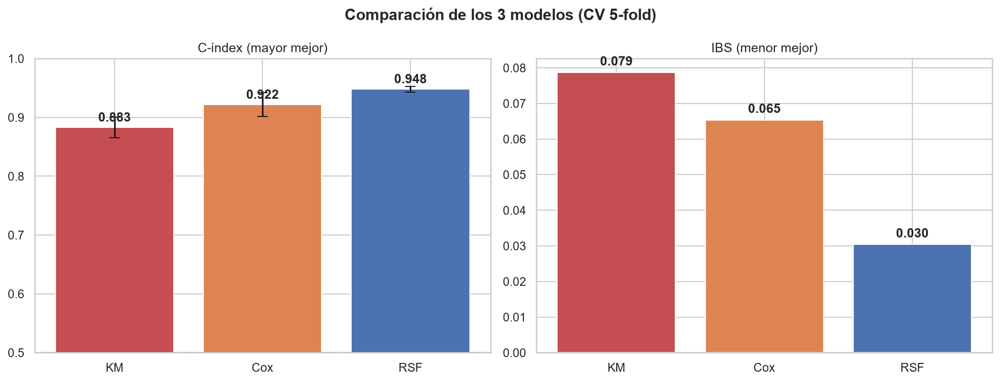
*Figura 1 — Comparación de los tres modelos de supervivencia (KM / Cox / RSF) por C-index e IBS.*

---

## 2. Entendimiento del problema

### 2.1 Definición formal

Para cada incendio se observan sus primeras 5 h y se define:

- `time_to_hit_hours` — horas desde t₀+5h hasta que el fuego llega a ≤ 5 km de una zona de evacuación.
  En censurados es el último tiempo observado (≤ 72 h).
- `event` — `1` si llegó a ≤ 5 km dentro de 72 h; `0` si está censurado.

La **submission** no se evalúa sobre esas columnas crudas, sino sobre **probabilidades a múltiples
horizontes**: `prob_12h, prob_24h, prob_48h, prob_72h`.

### 2.2 Por qué supervivencia y no clasificación binaria

| Alternativa | Razón de descarte |
|-------------|-------------------|
| **Clasificación binaria** (1 modelo por horizonte) | Trata a los 152 censurados como negativos definitivos (falso: solo sabemos que no llegaron en la ventana observada); no garantiza monotonicidad entre horizontes; multiplica el sobreajuste con n = 221. |
| **Regresión sobre `time_to_hit_hours`** | Ignora `event`: trataría los tiempos censurados como tiempos de evento reales, sesgando todo el ajuste. |

El análisis de supervivencia modela la función de supervivencia **S(t)** completa por incendio y de ahí
deriva los 4 horizontes de forma **coherente y monótona**, en lugar de 4 modelos sueltos que podrían
contradecirse (p. ej. predecir más probabilidad a 24 h que a 48 h).

### 2.3 El dato

- **Train:** 221 observaciones — **69 eventos (31.2 %)**, 152 censurados.
- **Test:** 95 observaciones.
- 37 columnas descritas en `metaData.csv`; features de distancia, crecimiento, cinemática del
  centroide, direccionalidad y metadatos temporales de las primeras 5 h.

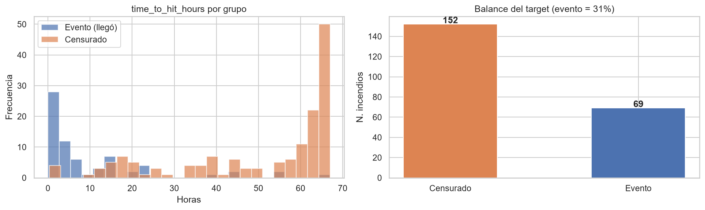
*Figura 2 — Distribución del target: proporción de eventos vs censurados y distribución de
`time_to_hit_hours`.*

### 2.4 El hallazgo central: separación a 5 km

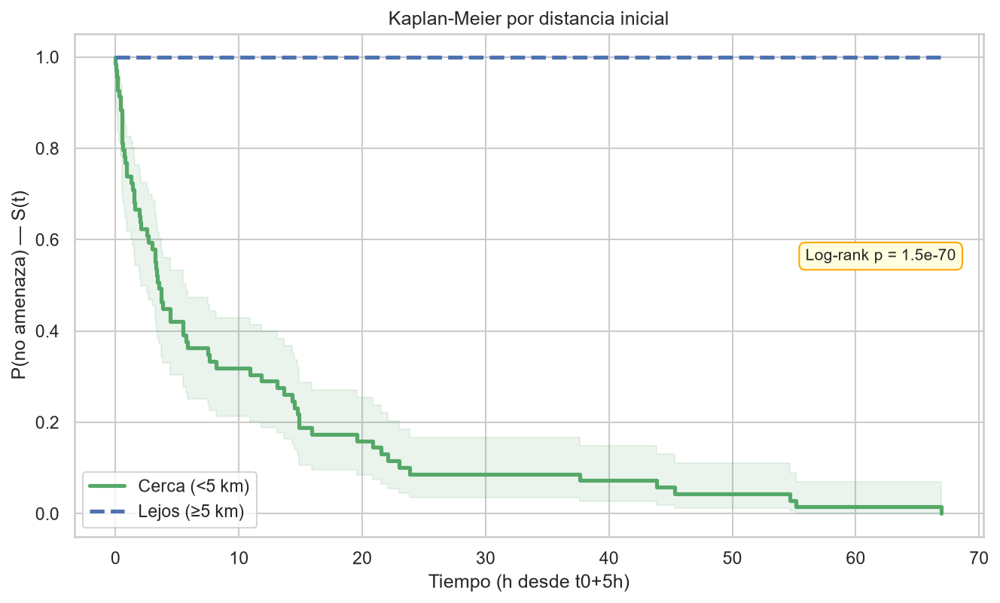
*Figura 3 — Curvas de Kaplan-Meier para incendios cercanos (< 5 km) vs lejanos (≥ 5 km). La separación
es casi total (log-rank p ≈ 1.5 × 10⁻⁷⁰): `dist_min_ci_0_5h` es el predictor dominante.*

---

## 3. Análisis exploratorio (EDA)

### 3.1 Distancia: la variable dominante

`dist_min_ci_0_5h` abarca de ~100 m a ~500 km (3 órdenes de magnitud) y concentra la mayor parte de la
señal. Por eso trabajamos también con su transformación logarítmica `log_dist_min`, que linealiza la
relación riesgo–distancia y estabiliza la escala.

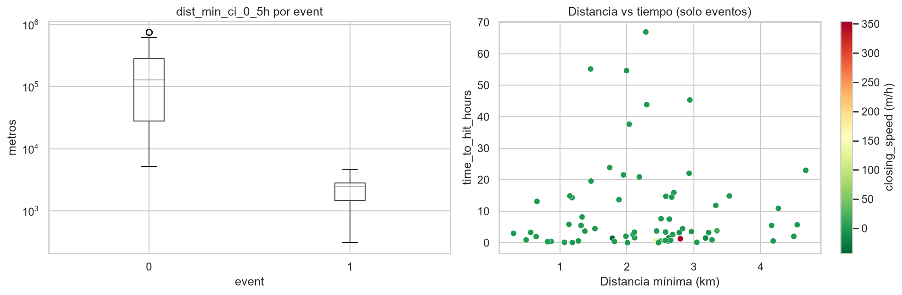
*Figura 4 — Distribución de la distancia mínima en las primeras 5 h y su relación con el evento.*

### 3.2 Correlación con el target

Usamos correlación de **Spearman** (sobre rangos) en lugar de Pearson porque:

1. Las relaciones son **monótonas pero no lineales** (el riesgo cae logarítmicamente con la distancia).
2. Hay **outliers y colas largas** — Spearman es robusto al trabajar con rangos.
3. Es **invariante a las transformaciones monótonas** ya aplicadas (`area_first_ha` y `log1p_area_first`
   dan el mismo Spearman con el target).

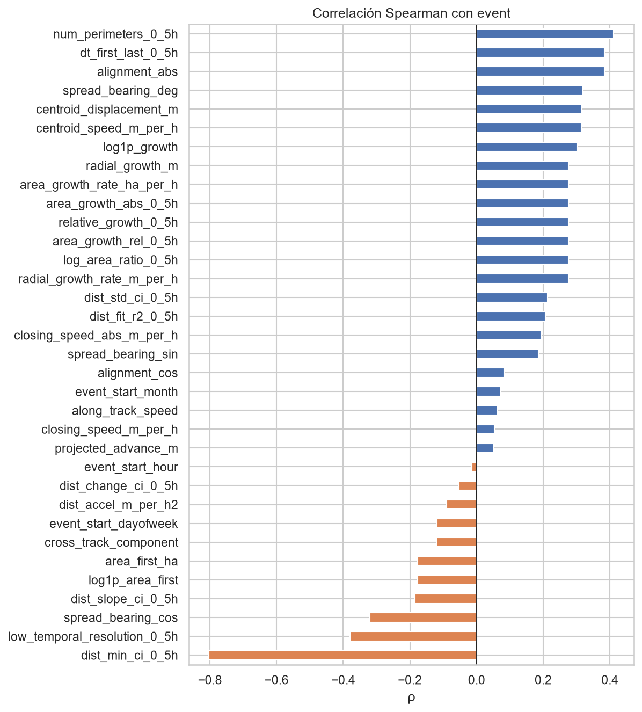
*Figura 5 — Correlación de Spearman de cada feature con el target (vista exploratoria para priorizar).*

> **Limitación reconocida:** la correlación con `time_to_hit_hours` trata los tiempos censurados como
> tiempos reales de evento. Con 68.8 % de censura, esa correlación está **sesgada**; la figura es solo
> exploratoria para *priorizar*. La inferencia válida sobre el tiempo la hacen KM/log-rank y Cox.

### 3.3 Multicolinealidad

El heatmap de Spearman revela **colinealidad extrema** entre features de crecimiento y cinemática
(varios pares con ρ ≈ 1.0). Esto motiva la poda por VIF para el modelo lineal (Cox, §4.3).

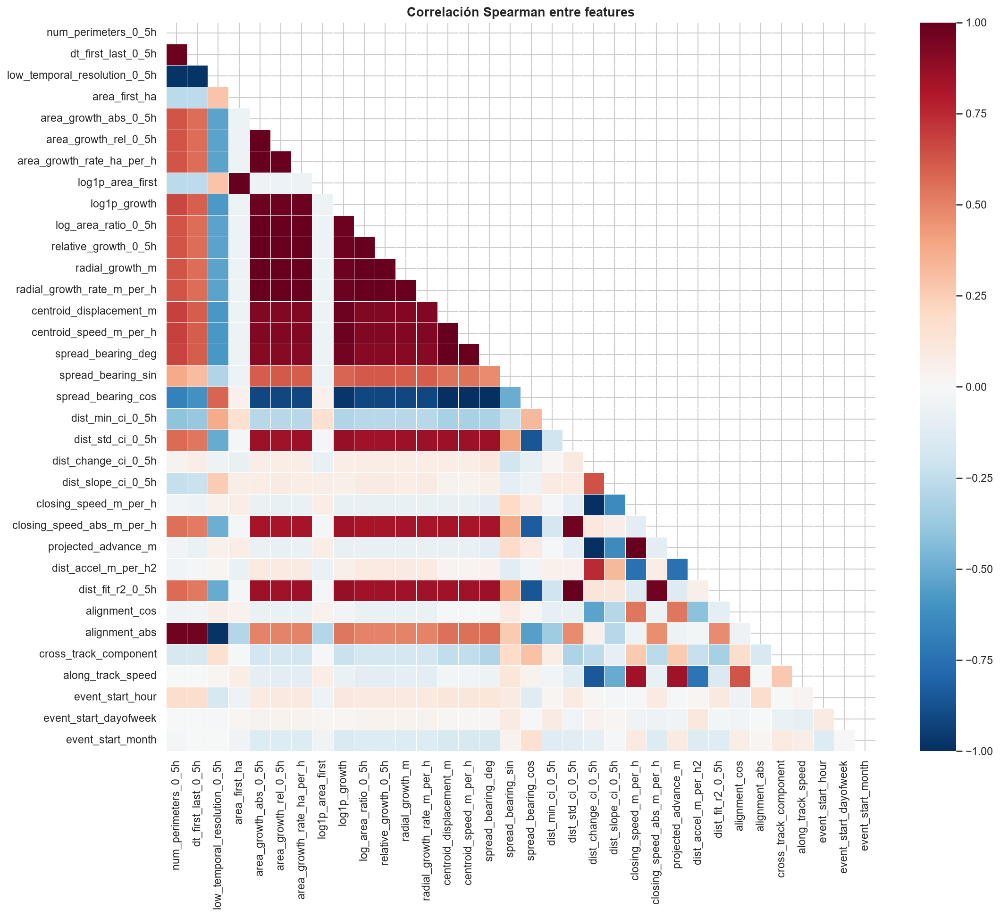
*Figura 6 — Matriz de correlación de Spearman entre features. Los bloques de alta correlación justifican
la selección por VIF para el Cox.*

### 3.4 Outliers y colas largas

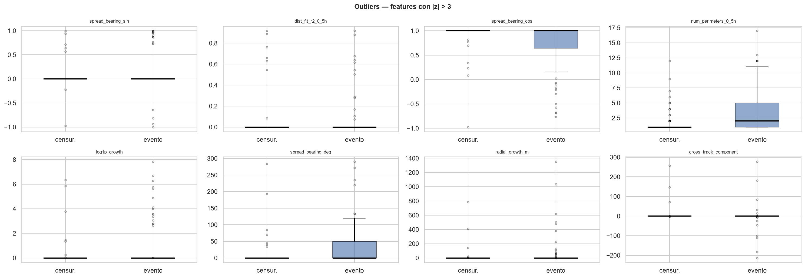
*Figura 7 — Detección de outliers (|z| > 3). Confirma colas largas y refuerza el uso de Spearman y de
transformaciones logarítmicas.*

### 3.5 Estimación de supervivencia por grupos

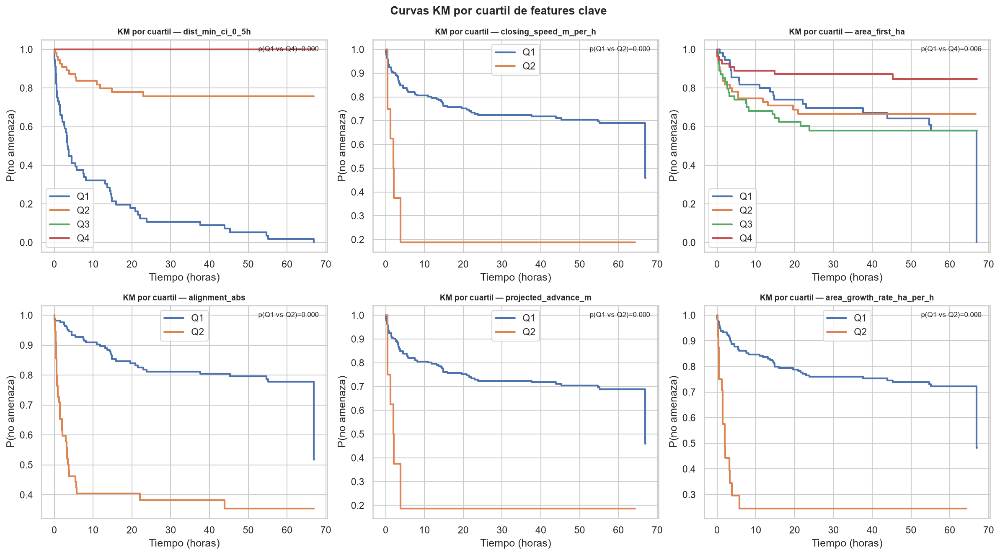
*Figura 8 — Curvas de Kaplan-Meier estratificadas por features clave; el riesgo se separa nítidamente por
distancia.*

### 3.6 Drift train/test

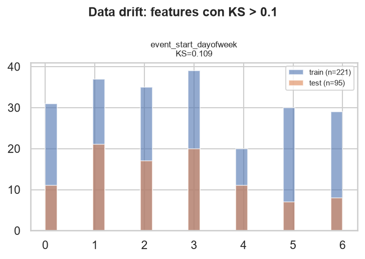
*Figura 9 — Comparación de distribuciones train vs test. El drift máximo (KS ≈ 0.11) no es significativo,
salvo la zona gris de distancia que se discute en §7.*

---

## 4. Metodología

### 4.1 Métricas: C-index + IBS/Brier (IPCW)

- **C-index** — generalización del AUC a datos censurados; mide la probabilidad de **ordenar bien** dos
  incendios por riesgo (0.5 = azar, 1.0 = perfecto). Responde *"¿ordena bien el riesgo?"*.
- **Integrated Brier Score (IBS) y Brier por horizonte con IPCW** — error cuadrático entre probabilidad
  predicha y resultado observado, con corrección **Inverse Probability of Censoring Weighting** para el
  sesgo de la censura. Responde *"¿son creíbles las probabilidades?"*.

Necesitamos ambas porque la competencia puntúa **probabilidades**, no un ranking. Referencia: el IBS del
modelo nulo (predecir 0.5 siempre) es **0.25**.

### 4.2 Estrategia de validación

- **CV 5-fold estratificado por `event`** — con solo 69 eventos, estratificar mantiene la proporción
  ~31 % por fold (cada fold de validación ~44 incendios, ~14 eventos).
- **Nested feature validation** — la selección de features se **rehace dentro de cada fold**, usando solo
  el train del fold. Evita el *leakage* del enfoque "flat" (seleccionar features con todo el train y luego
  hacer CV sobre ellas, lo que infla la métrica). El **optimismo = flat − nested** cuantifica esa
  inflación; en nuestro caso resultó **pequeño**, lo que da derecho a defender el C-index de 0.948.
- **Adversarial validation** — un clasificador train-vs-test da **AUC ≈ 0.5** → train y test son
  indistinguibles, por lo que el CV en train es un buen proxy del test.

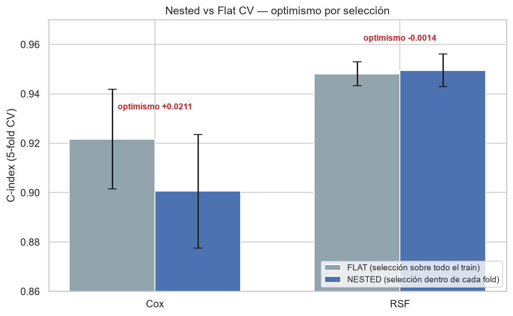
*Figura 10 — Comparación flat vs nested CV. La brecha de optimismo es pequeña: el desempeño no está
inflado por la selección de features.*

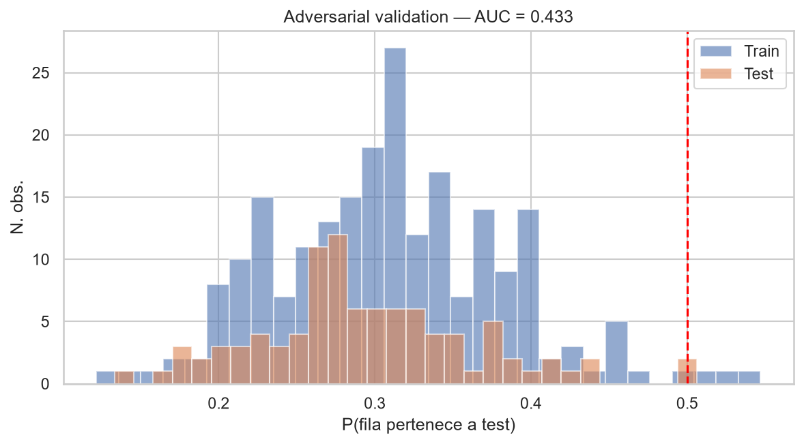
*Figura 11 — Adversarial validation: AUC cercano a 0.5 confirma que la validación en train es transferible
al test.*

### 4.3 Selección de features — dos criterios según el modelo

**Cox PH — VIF iterativo (multicolinealidad).** Flujo: 33 features + 2 derivadas → filtro univariado
C ≥ 0.55 → 21 candidatas → VIF iterativo (eliminar la peor hasta VIF ≤ 5) → **11 finales**. El Cox es
lineal y la colinealidad vuelve casi singular la matriz de información (Hessiana): los coeficientes y sus
errores estándar explotan y el modelo deja de converger. Dejar **una sola representante** por bloque
colineal elimina la redundancia, no la información, y devuelve un Hazard Ratio estable e interpretable.

- *Evidencia:* Cox con 33 features → C = 0.8655 ± **0.0986** (varianza enorme); con 11 features →
  C = 0.9219 ± 0.0228 (varianza ~5× menor). La selección **estabiliza** el modelo, no solo lo simplifica.

**RSF — Permutation importance.** Criterio: eliminar features con importancia = 0 **y** std = 0 (sin
señal en ninguna de las 15 permutaciones). 33 → **24 seleccionadas**. Como los árboles son **inmunes a la
multicolinealidad** (parten variable a variable, sin coeficientes que estimar), aquí la selección es por
parsimonia, **no por desempeño**: el C-index se mantiene invariante (33 feat → 0.9485; 24 feat → 0.9481;
Δ = −0.0004, dentro del ruido).

> **El contraste es la clave:** la poda del Cox (33 → 11) es **obligatoria**; la del RSF (33 → 24) es
> **opcional y cosmética**. El mismo dato produce dos regímenes opuestos según la naturaleza del modelo:
> lineal (sensible a colinealidad) vs árboles (invariante a ella).

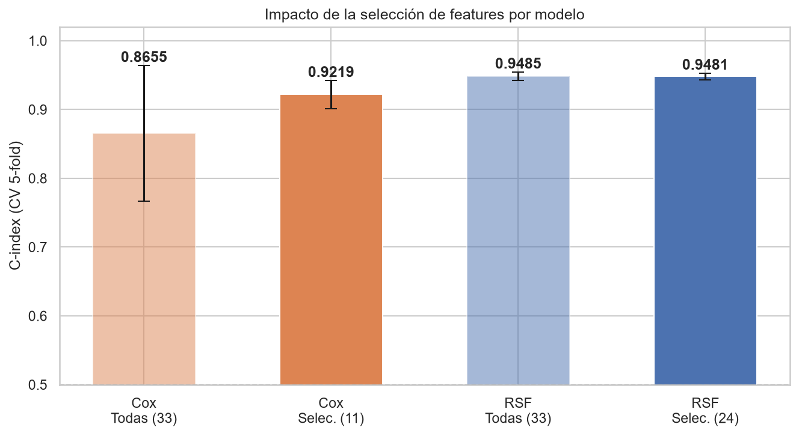
*Figura 12 — Comparación de configuraciones de features por modelo (C-index e IBS).*

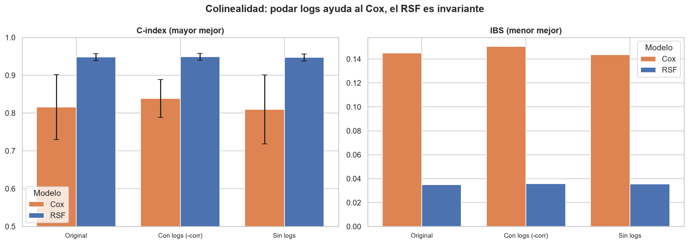
*Figura 13 — Experimento de aislamiento de la colinealidad (data cruda, L2 leve): quedarse con una log
representante sube el C-index del Cox de 0.816 a 0.839 y reduce su varianza casi a la mitad, mientras el
RSF se mantiene invariante (C ≈ 0.948). Confirma que el problema es específico del modelo lineal.*

### 4.4 Hiperparámetros

| Modelo | Hiperparámetro | Rango probado | **Elegido** |
|--------|----------------|---------------|:-----------:|
| **RSF** (`scikit-survival`) | `n_estimators` | 300, 500 | **300** |
| | `min_samples_leaf` | 5, 10, 15, 20 | **10** |
| | `max_features` | `"sqrt"`, 0.5 | **0.5** |
| **Cox PH** (`lifelines`) | `penalizer` (L2) | 0.0, 0.05, 0.10 | **0.05** |
| **KM estratificado** | estratificación | cuartiles de `log(dist_min_ci_0_5h)` | **4 cuartiles** |

El grid del RSF no es factorial completo (2×4×2 = 16): se evaluó un **conjunto curado de 6 combinaciones**,
deliberadamente pequeño para n = 221 y evitar overfitting. El `penalizer` L2 = 0.05 estabiliza el Cox.

### 4.5 Por qué RSF como modelo de entrega y Cox como interpretación

El objetivo operativo es **prevenir, no explicar**: predecir con la mayor precisión posible si un incendio
representará una amenaza, para activar evacuaciones a tiempo. La asimetría del error lo decide:

| Tipo de error | Consecuencia | Aceptabilidad |
|---------------|--------------|:-------------:|
| **Falso positivo** (predecir amenaza que no llega) | Evacuación innecesaria — costo logístico, reversible | ✅ Aceptable |
| **Falso negativo** (no predecir amenaza que llega) | Zona habitada sin evacuar — **vidas en riesgo** | ❌ Inaceptable |

El C-index del RSF (0.948 > Cox 0.922) discrimina mejor los positivos reales y reduce la probabilidad del
falso negativo. El Cox se conserva como modelo interpretable (Hazard Ratios) y mejor referencia de
calibración.

---

## 5. Resultados

### 5.1 Scores por escenario (CV 5-fold estratificado por evento)

| Modelo | Escenario | n_feat | C-index CV | IBS | Estado |
|--------|-----------|:------:|:----------:|:---:|--------|
| KM estratificado | cuartiles `log_dist` | — | — | — | Referencia |
| **RSF** | **Seleccionadas (final)** | 24 | **0.9481 ± 0.0049** | **0.0304** | ✅ Submission |
| RSF | Todas | 33 | 0.9485 ± 0.0061 | — | — |
| RSF | Aumentado (+10 nuevas) | 34 | 0.9517 ± 0.0080 | 0.0307 | Descartado (ΔC en el ruido, IBS peor) |
| **Cox** | **Seleccionadas VIF ≤ 5 (final)** | 11 | **0.9219 ± 0.0228** | **0.0654 ± 0.0259** | ✅ Interpretable |
| Cox | Todas | 33 | 0.8655 ± 0.0986 | — | Descartado (varianza por colinealidad) |

**Brier por horizonte del Cox final:** BS@12h = 0.0744 ± 0.0202 · BS@24h = 0.0664 ± 0.0268 ·
BS@48h = 0.0593 ± 0.0310. Frente al modelo nulo (IBS = 0.25), el Cox (0.065) es **~4× mejor**.

### 5.2 Importancia de variables — RSF

`dist_min_ci_0_5h` (0.0721) y `log_dist_min` (0.0648) concentran **~72 %** de la señal.

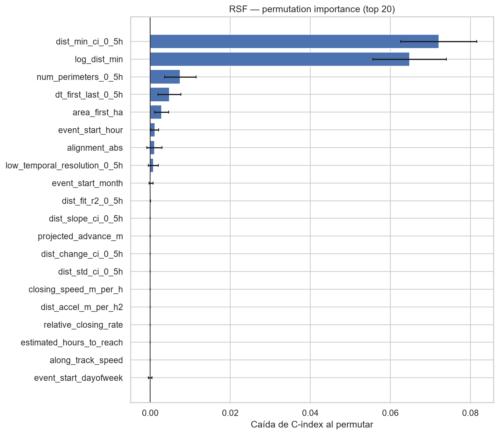
*Figura 14 — Permutation importance del RSF. La distancia inicial domina.*

### 5.3 Interpretación — Cox PH

Solo 2 features resultan significativas:

- `log_dist_min` — **HR 0.217** (protector): a mayor distancia inicial, mucho menor riesgo.
- `alignment_abs` — **HR 1.412** (riesgo): mayor alineamiento del avance hacia la zona aumenta el riesgo.

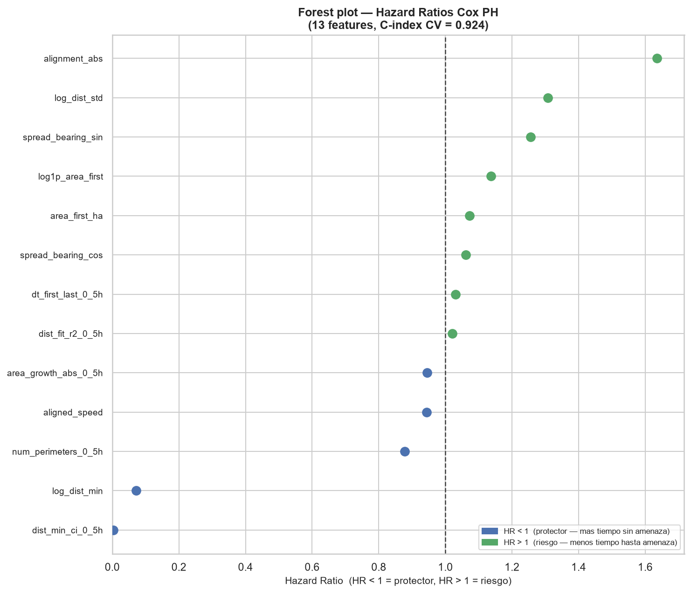
*Figura 15 — Forest plot de Hazard Ratios del Cox (con intervalos de confianza). Comunica *por qué* un
incendio es peligroso.*

### 5.4 Calibración

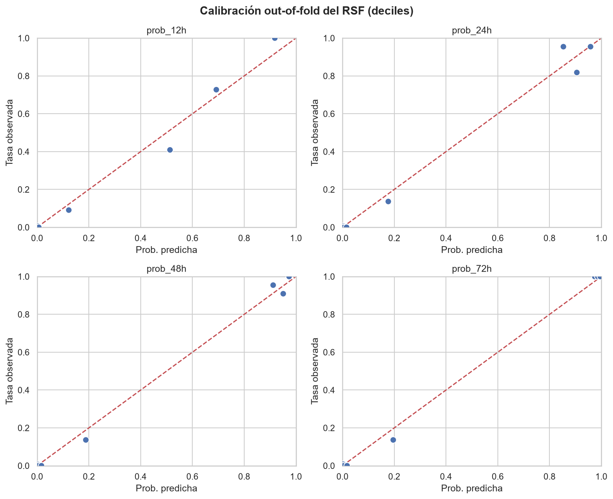
*Figura 16 — Curva de calibración: las probabilidades predichas se aproximan a las frecuencias observadas.*

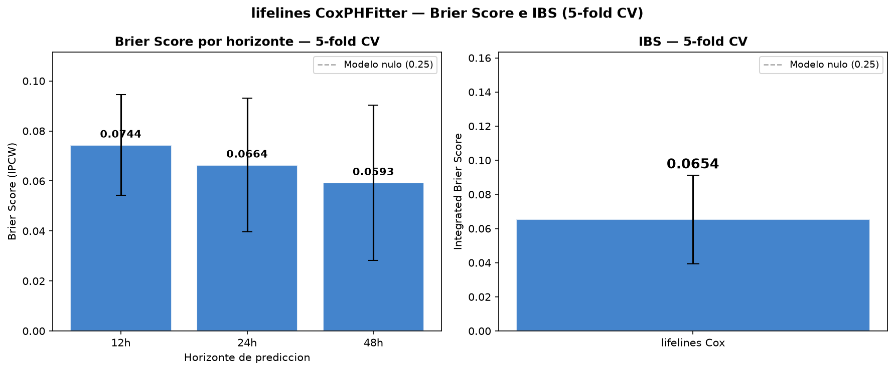
*Figura 17 — Brier Score del Cox por horizonte vs el modelo nulo (0.25).*

### 5.5 Predicciones medias en test y coherencia

| Horizonte | KM | Cox | RSF |
|-----------|:--:|:---:|:---:|
| 12h | 22.4 % | 21.6 % | 18.5 % |
| 24h | 29.0 % | 29.4 % | 26.4 % |
| 48h | 30.3 % | 31.6 % | 28.0 % |
| 72h | 31.7 % | **42.0 %** | 29.8 % |

> El Cox diverge al alza a 72 h porque su S(t) se extiende más en el tiempo, al no estar limitada por la
> distribución empírica de los árboles.

Se verificó la **monotonicidad** de las probabilidades acumuladas (12 → 24 → 48 → 72 h) por incendio,
como exige la coherencia de una función de supervivencia.

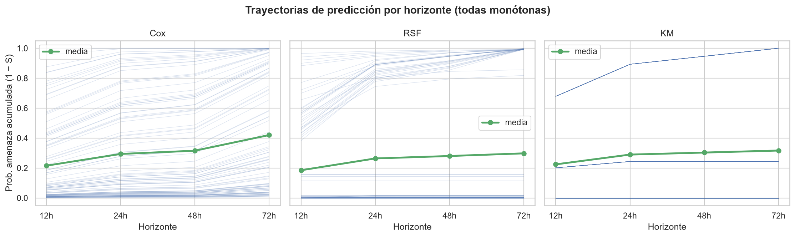
*Figura 18 — Verificación de monotonicidad: ninguna predicción decrece al aumentar el horizonte.*

---

## 6. Limitaciones y consideraciones éticas

### 6.1 Limitaciones técnicas

- **Tamaño de muestra (n = 221, 69 eventos).** Limita la complejidad de modelos defendibles; por eso se
  descartan XGBoost/redes (sobreajustarían sin ganancia: el RSF ya satura el C-index en ~0.95).
- **Separación casi perfecta a 5 km.** Hace el problema "fácil" en distribución, pero frágil fuera de ella
  (ver zona gris). El modelo aprende esencialmente la distancia.
- **Correlación con el tiempo sesgada por censura** (§3.2) — usada solo como vista exploratoria.
- **Zona gris 5–15 km (riesgo abierto, no resuelto).** El train no contiene **ningún** incendio entre
  5 y 15 km; el test tiene **7 (7.4 %)**, todos con `closing_speed = 0` y `alignment_abs = 0`. Las
  predicciones ahí son **pura extrapolación**. Opciones evaluadas: (A) no hacer nada / extrapolar
  *[baseline actual]*; (B) datos sintéticos 5–15 km *[inyecta un prior; depende de las reglas]*;
  (C) análisis de incertidumbre *[más defendible, bajo riesgo]*; (D) anclar a literatura de propagación.
  **Decisión actual:** mantener (A) con la zona gris explícitamente señalada; **pendiente** evaluar (C).

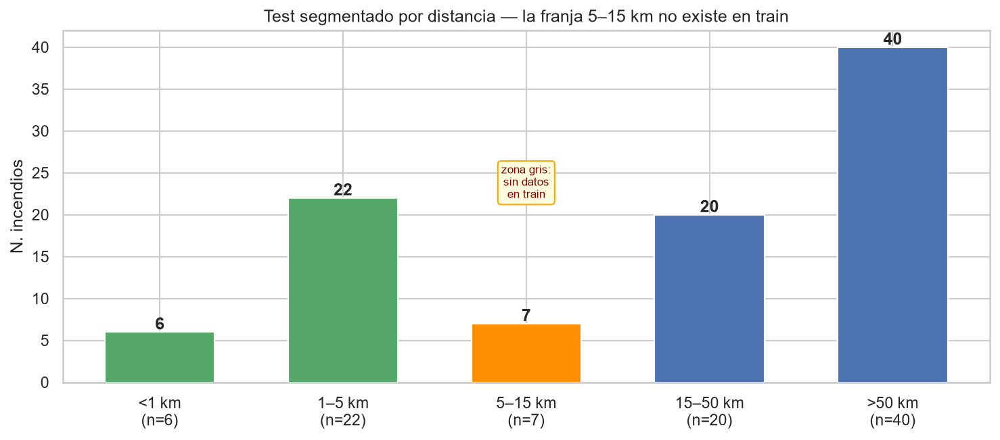
*Figura 19 — Distribución de distancia en test: los 7 incendios de la zona gris (5–15 km) caen fuera del
rango observado en train.*

### 6.2 Consideraciones éticas

- **Asimetría del error con impacto en vidas.** Un falso negativo (no evacuar cuando el incendio sí llega)
  es inaceptable; priorizamos sensibilidad sobre especificidad. Aun así, los **falsos positivos no son
  gratis**: evacuaciones innecesarias tienen costo logístico, erosionan la confianza y pueden generar
  fatiga de alerta. El balance debe decidirlo la autoridad operativa, no el modelo en solitario.
- **El modelo es soporte, no sustituto, de la decisión humana.** Con n pequeño y extrapolación en la zona
  gris, su salida debe acompañarse de incertidumbre y juicio experto.
- **Equidad y cobertura.** Si los datos de entrenamiento sub-representan ciertos terrenos, climas o
  comunidades, el modelo podría discriminar peor en esas zonas. No fue auditado por subgrupos
  (no disponibles en los datos).
- **Transparencia.** Se entrega el RSF por precisión, pero el Cox provee la explicación auditable (HR con
  intervalos), necesaria para justificar decisiones de evacuación ante la población.

---

## 7. Próximos pasos

1. **Resolver la zona gris (prioridad).** Implementar el análisis de incertidumbre (opción C): intervalos
   y análisis de sensibilidad para las predicciones de 5–15 km, comunicando explícitamente la baja
   confianza. Evaluar (B/D) solo si las reglas lo permiten y aportan señal validada.
2. **Calibración por horizonte.** Recalibrar el RSF (que tiene la mejor discriminación pero peor IBS
   relativo que su C-index sugiere) — p. ej. isotónica o Platt sobre las probabilidades a cada horizonte.
3. **Cuantificar incertidumbre del RSF.** Intervalos vía los árboles del bosque, no solo la media.
4. **Auditoría de equidad** si se obtienen metadatos de subgrupo (región, terreno, tipo de comunidad).
5. **Validación externa** con incendios de otra temporada/región para medir la transferencia real más
   allá del adversarial validation interno.

---

## 8. Anexos

### 8.1 Stack y reproducibilidad

- **Modelos:** `scikit-survival` (RSF), `lifelines` (Cox PH, KM).
- **Semillas:** `random_state = 42`, `n_jobs = −1`.
- **Validación:** CV 5-fold estratificado por evento; nested CV para selección de features; adversarial
  validation train-vs-test.
- Documento de defensa metodológica detallada: `decisiones.md`.

### 8.2 Features derivadas probadas y descartadas

Se probaron 10 features nuevas en 2 rondas (ratios/escala y cinemáticas). **Ninguna mejoró** el C-index
fuera del ruido. Ejemplos: `projected_dist_12h` (VIF = 222 395, combinación lineal exacta);
`etc_hours`/`eta_hours` (C < 0.55); `expansion_vs_movement` (p = 0.95 multivariado, ΔC = +0.0003). La
re-evaluación con RSF confirmó el descarte (base 24 feat: 0.9481 vs aumentado 34 feat: 0.9517, dentro del
ruido e IBS peor).

### 8.3 Galería de figuras complementarias

| Figura | Contenido |
|--------|-----------|
| `02_features_distancia.png` | Distribuciones del bloque de features de distancia |
| `02_features_crecimiento.png` | Features de crecimiento del incendio |
| `02_features_cinematica_centroide.png` | Cinemática del centroide |
| `02_features_direccionalidad.png` | Direccionalidad / alineamiento |
| `02_features_cobertura_temporal.png` | Cobertura temporal de las primeras 5 h |
| `02_features_metadata_temporal.png` | Metadatos temporales |
| `05_km_global.png` | Curva de Kaplan-Meier global |
| `10_temporal_analysis.png`, `11_temporal_heatmap.png` | Análisis temporal |
| `15_rsf_survival_curves.png` | Curvas de supervivencia individuales del RSF |
| `17_prediction_distribution.png` | Distribución de predicciones en test |
| `23_modelos_distributions.png` | Distribución de predicciones por modelo |
| `25_new_features_cox.png`, `26_kinematic_features_cox.png`, `27_cox_base_vs_new_test.png`, `31_new_features_rsf.png` | Experimentos de features derivadas |

> **Nota sobre figuras:** el directorio `figures/` contiene duplicados en español/inglés (serie `02_*`) y
> versiones alternativas (`12_cox_feature_importance`, `32_cox_forest_plot`, `22_modelos_scatter`). Este
> reporte usa una sola versión coherente de cada una; conviene depurar los duplicados antes de la entrega
> final.

---

*Data Wizards · WiDS Datathon 2026 · 2026-06-12*
